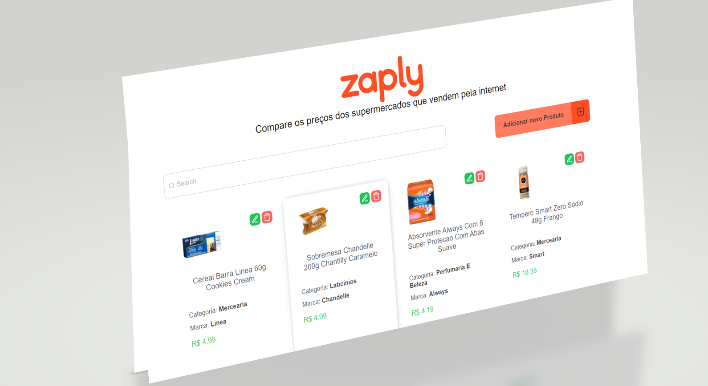
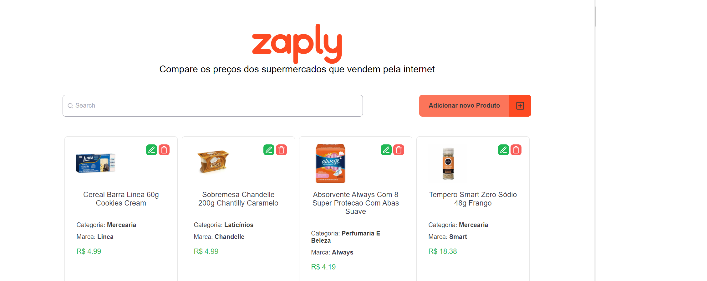
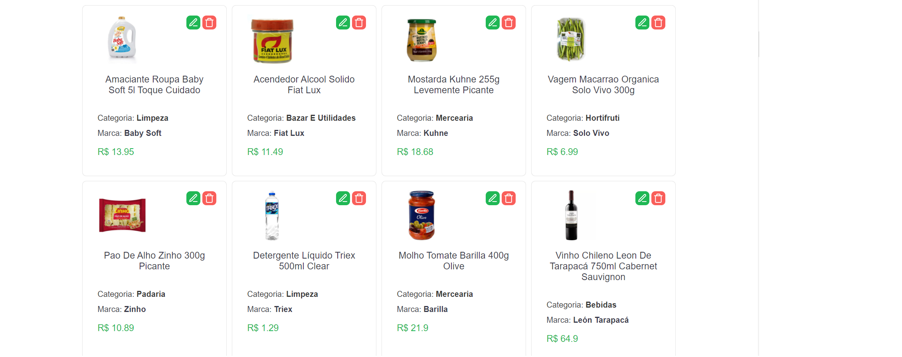
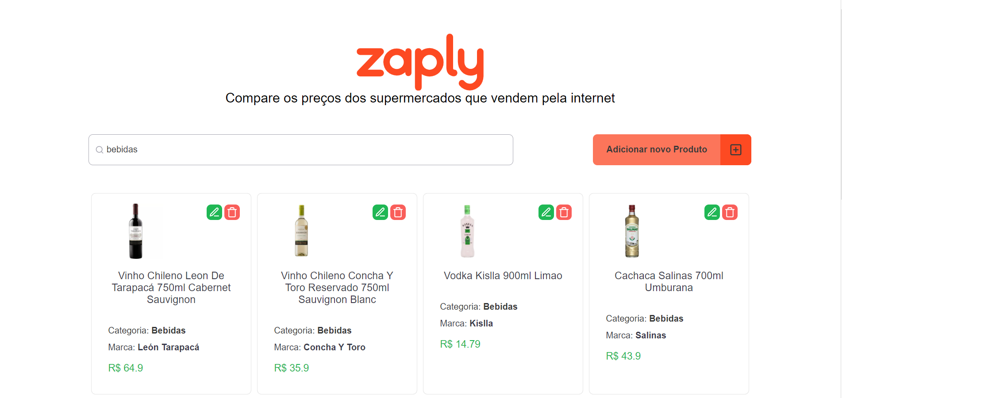
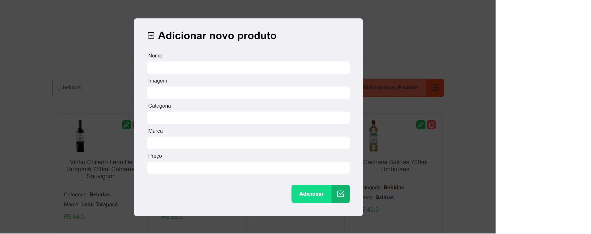
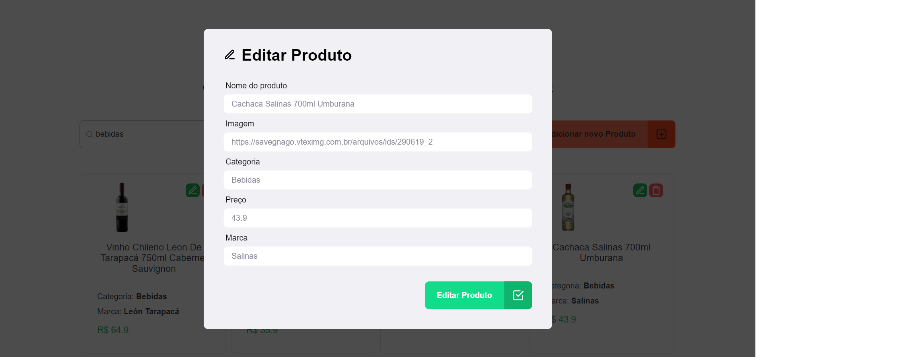
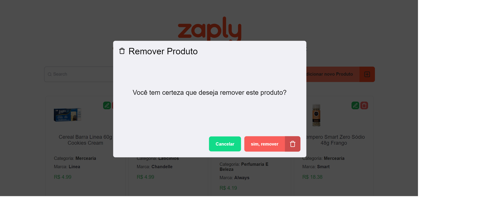

# Zaply Challenge 

Aplicação que permite você criar, listar, editar, deletar e filtrar seus produtos.

---

### Tecnologias Utilizadas:

## Front-end
  # ReactJS, Typescript, StyledComponents, Jest, Axios, Yup,

## Back-end
  # NodeJS, Typescript, TypeORM, Express, Postgres, Swagger, Yup

---

### Para acessar o projeto Front-end, entre na pasta:

    zaply-web

### Para acessar o projeto Back-end, entre na pasta:

    zaply-server

