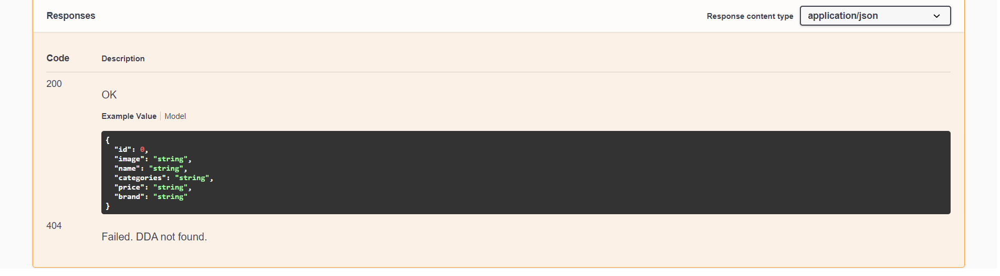
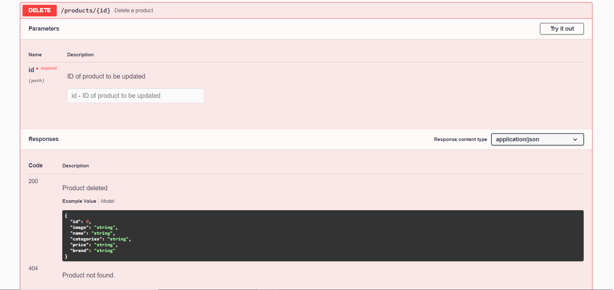
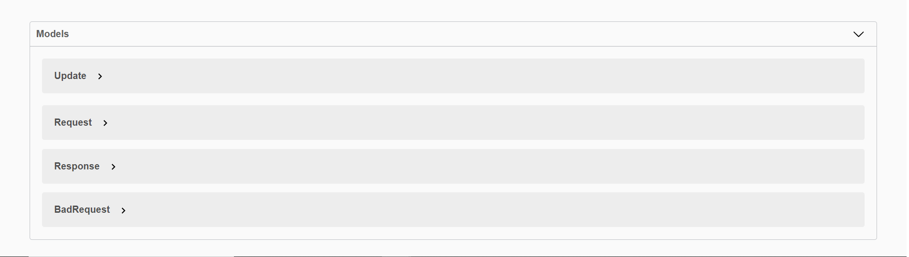

## Zaply Challenge 🛠

Aplicação que permite você criar, listar, editar, deletar e filtrar seus produtos em uma api.

---

## **_Tecnologias Utilizadas_**

## NodeJS, Typescript, TypeORM, Express, Postgres, Swagger, Yup

---

## **_Instalação | Execução_**

Clone esse repositório rodando o comando:

    git clone https://github.com/MarthinKorb/challenge-zaply/tree/master/zaply-server

---

Abra o terminal na pasta do projeto e instale as dependências rodando o comando:

    yarn

Agora vamos iniciar nosso servidor node rodando o comando:

    yarn dev

No console, deverá aparecer a mensagem: _Server running on port 3000_

---

## Banco de Dados Postgres

Nessa aplicação, é usado um container no docker para o serviço de banco de dados.
Para informações sobre configuração do Postgres no Docker, acesse *https://hub.docker.com/_/postgres* ou ***https://typeorm.io/#/***

**_Obs: o arquivo orm.config é o responsável pelas configurações de banco de dados_**

Após a configuração do **_banco de dados_**, rode o comando:

    yarn typeorm migration:run

Esse comando criará as tabelas no banco.

---

## **_Swagger_**

Para acessar a documentação da API, com o servidor rodando, acesse _http://localhost:3333/api-docs/_

    
    
    
    
    
    
    
    

---

**Feito!** ✔

---
