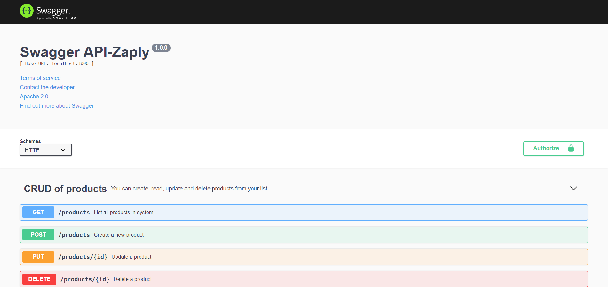
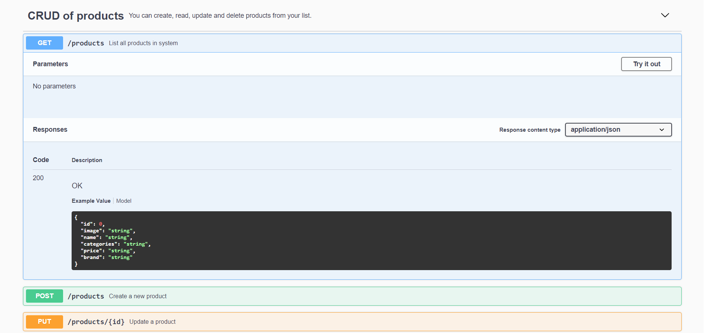
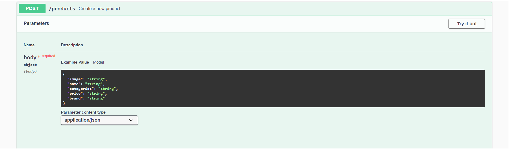
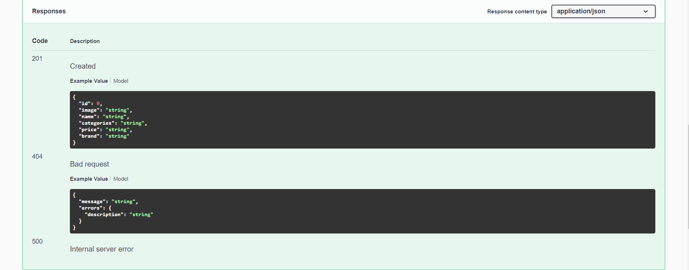
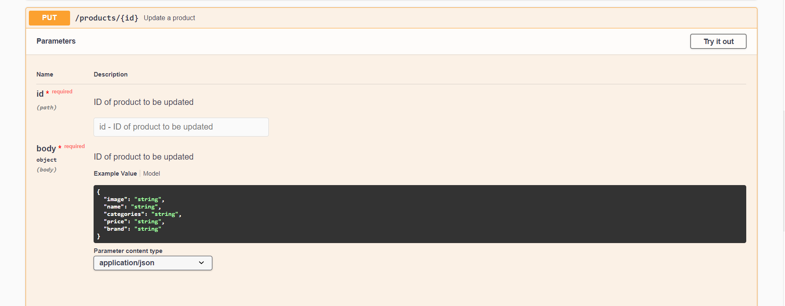

## VUTTR -  ***Very Usefull Tools to Remember*** 🛠

Aplicação que armazena suas ferramentas favoritas. Nela, você pode criar, deletar, editar e listar todas as suas ferramentas favoritas.

----------------------------------

## ***Tecnologias Utilizadas***

##### NodeJS, Typescript, TypeORM, Express, Postgres, Swagger, Yup

----------------------------------------------------

## ***Instalação | Execução***

Clone esse repositório rodando o comando:

    git clone https://github.com/MarthinKorb/backend-VUTTR

----------------------------------------------------

Abra o terminal na pasta do projeto e instale as dependências rodando o comando:

    yarn 

Agora vamos iniciar nosso servidor node rodando o comando:

    yarn dev

No console, deverá aparecer a mensagem: *Server running on port 3333*

_________________________________________________________________

## Banco de Dados Postgres

Nessa aplicação, é usado um container no docker para o serviço de banco de dados. 
Para informações sobre configuração do Postgres no Docker, acesse *https://hub.docker.com/_/postgres* ou ***https://typeorm.io/#/***

***Obs: o arquivo orm.config é o responsável pelas configurações de banco de dados***

Após a configuração do ***banco de dados***, rode o comando: 
    
    yarn typeorm migration:run    
    
Esse comando criará as tabelas no banco.  

-------------------------------------------------

## ***Swagger***

Para acessar a documentação da API, com o servidor rodando, acesse *http://localhost:3333/api-docs/*

    
    
    
    
    

_____________________________________________________

**Feito!** ✔

Agora é só adicionar as suas ferramentas favoritas na lista!

----------------------------------------------------

