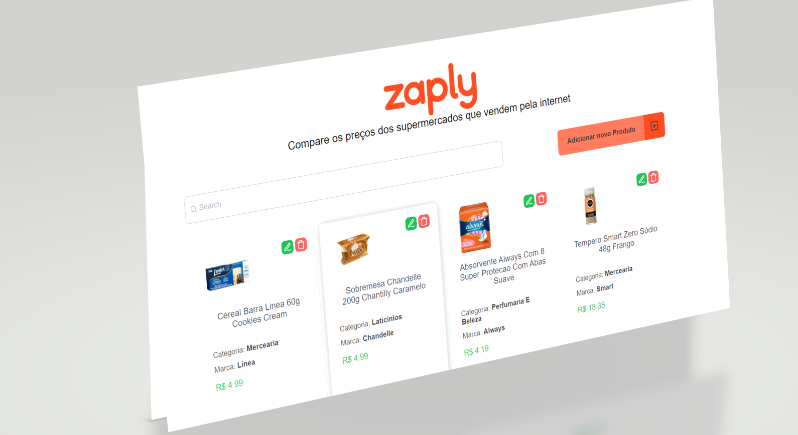
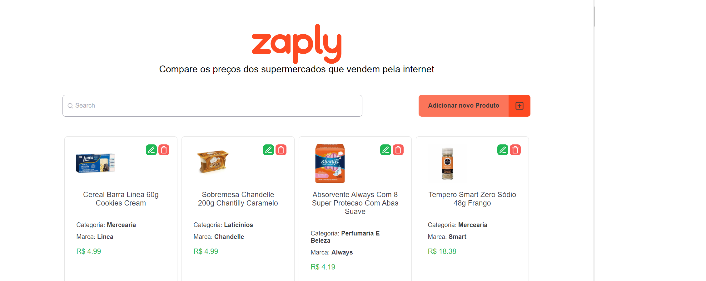
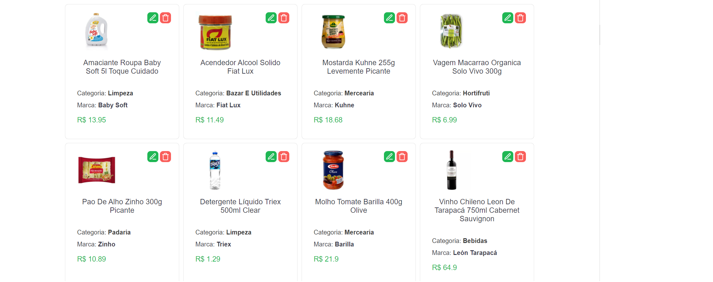
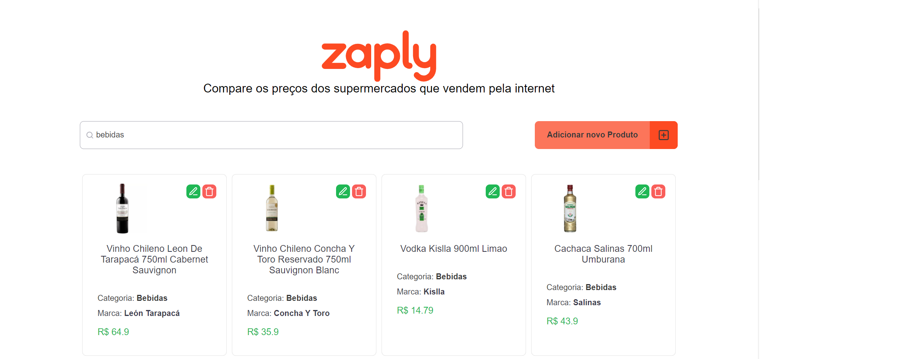
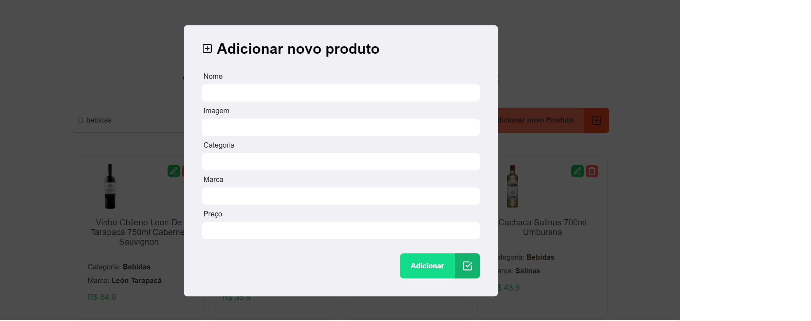
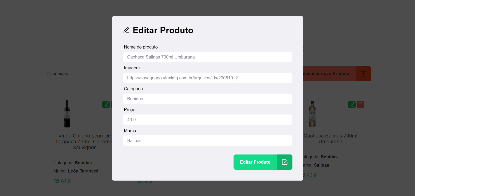
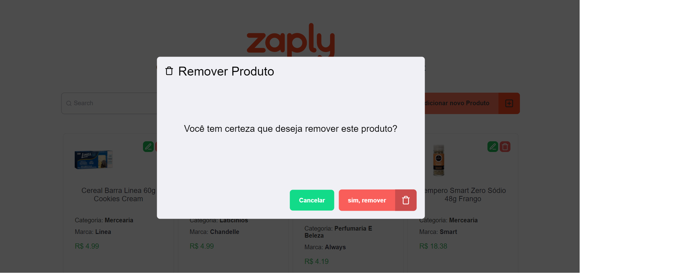

# Zaply Challange 🛠

**Lista de Produtos**

Aplicação que permite você criar, listar, editar, deletar e filtrar seus produtos em uma api.

---

## Tecnologias Utilizadas:

#### ReactJS, Typescript, StyledComponents, Jest, Axios, Yup,

---

---

## Instalação | Execução

Clone esse repositório rodando o comando:

    git clone https://github.com/MarthinKorb/challenge-zaply.git

---

**Acesse a pasta zaply-web usando o comando**

    cd zaply-web

Após, instale as dependências rodando o comando:

    yarn

Agora vamos iniciar nosso front-end:

    yarn start

---

Para podermos consumir dados, foi criada uma _Fake API_. Execute o comando abaixo para poder conectar com o servidor fake.

    npx json-server server.json

Também foi criada uma API com NodeJS e banco de dados Postgres para conectar com esta aplicação. Você pode encontrar mais informações de intsalação e execução no repositório:

    https://github.com/MarthinKorb/challenge-zaply/tree/master/zaply-server

**Feito!** ✔

---
